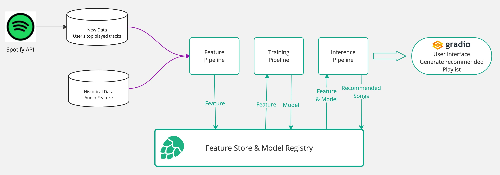

# ID2223 Final Project - Spotify Music Recommender
Group 25 - Mengmeng Yang, Zong-rong Yang
## Overview
A personalized music recommendation system that aims to provide personalized music recommendations by analyzing user's Spotify listening history and leveraging the K-Nearest Neighbors (KNN) algorithm. The system encompasses data preprocessing, model training, and real-time inference to handle large-scale music data efficiently and deliver timely song suggestions.
This project creates an system that:
1. Connects to users' Spotify accounts
2. Analyzes their top played tracks
3. Generates personalized recommendations
4. Creates recomendation playlists
5. Automatically refreshes recommendations based on new listening data

## System Architecture

The system consists of several key components:
### Data Collection and Processing
The dataset used for this project comprises two main sources:

1. **User Data**:
   - **Source**: Users' Spotify accounts.
   - **Content**: Top played tracks, listening history.

2. **Historical Data**:
   - **Sources**:
     - [maharshipandya/spotify-tracks-dataset](https://huggingface.co/datasets/maharshipandya/spotify-tracks-dataset)
     - [tomigelo/spotify-audio-features](https://www.kaggle.com/datasets/tomigelo/spotify-audio-features)
     - [thedevastator/spotify-tracks-genre-dataset](https://www.kaggle.com/datasets/thedevastator/spotify-tracks-genre-dataset)
   - **Content**: Comprehensive information on approximately 280,000 tracks, including audio features and metadata.
   - **Purpose**: Provides a rich dataset for training the recommendation model, ensuring diverse and extensive coverage of songs and their attributes.

### Processing Pipeline
- Feature Pipeline: 
  - Cleans and preprocesses raw data from both new and historical sources.
- Training Pipeline: 
  - Loads historical and newly updated data from Hopsworks.
  - Trains the K-Nearest Neighbors (KNN) Regressor model to predict user preferences.
  - Saves the trained model to the model registry for inference.
- Inference Pipeline: 
  -  Uses the trained model to generate song recommendations based on user preferences and listening history.

### Storage and Registry
- Feature Store & Model Registry: Centralizes storage of features and trained models
- Manages data flow between different pipeline stages

### User Interface
- [Gradio interface](https://huggingface.co/spaces/JeremyatKTH/Spotify_Music_Recommender) for end users
- Displays generated recommended songs
- Provides user interaction capabilities

## Technologies
- **Programming Language**: Python 3.10
- **Machine Learning**: scikit-learn
- **Data Processing**: pandas, NumPy
- **Web Interface**: Gradio
- **Automation**: GitHub Actions
- **Feature Store & Model Registry**: Hopsworks
- **Version Control**: Git
- **Data Collection**: Spotify Web API, Hugging Face, Kaggle

## Future Improvements
### Planned Features
- Advanced recommendation algorithms
- Genre-based filtering
- Mood-based playlists

